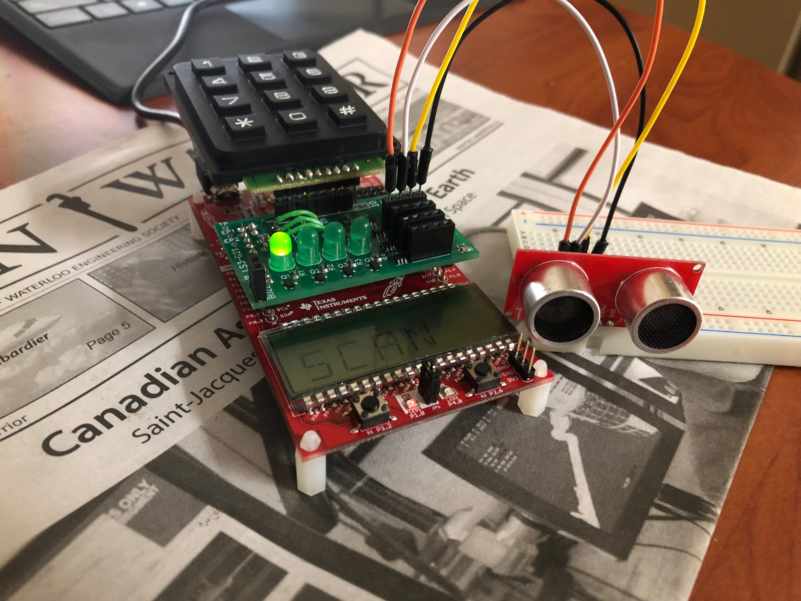
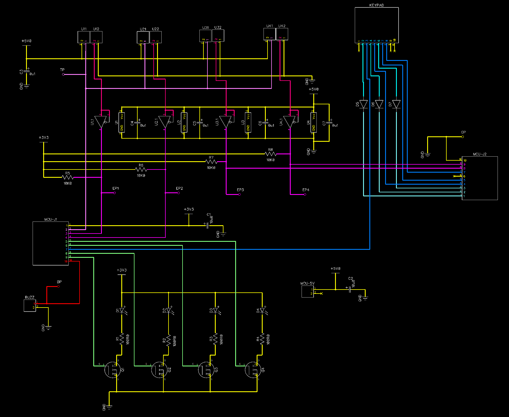
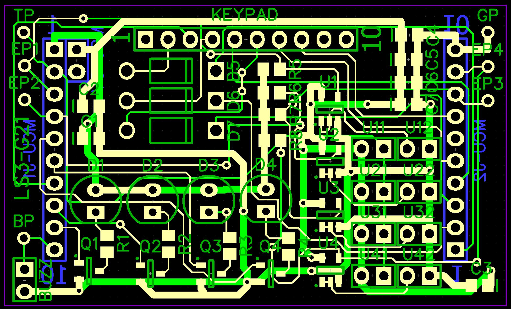

# Embedded Home Security System

The system is able to scan for movements in designated zones that the user chooses to arm within a house-hold setting. The arming and disarming of zones is done through a user-interface that includes a keypad for input and an LCD screen for output. An audible alarm is implemented to respond to certain triggers in armed zones and LEDs are used to signal which zones are currently armed. Ultrasonic distance sensors are used to monitor for movement within armed zones. 

The system is implemented on an MSP430FR4133 microcontroller with an attached custom PCB.

## The Schematic

## The PCB

